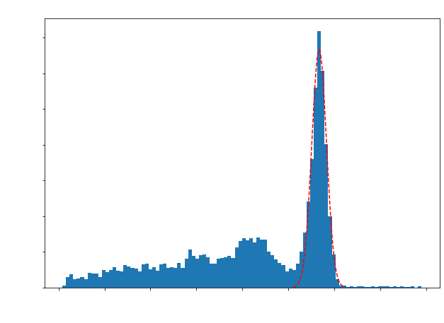
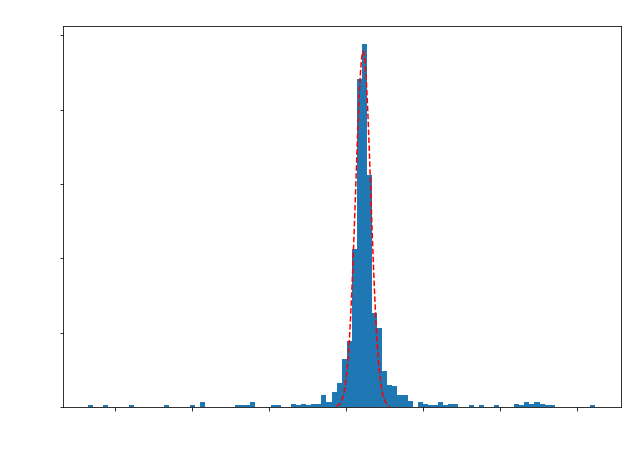
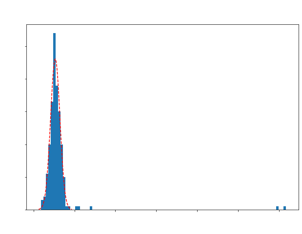

# Experimental PET-Detector Response Code Package:
This python code suite is used to analyze and visualize experimental data outlining the detector response of PET scanners using PETSys readout-electronics. This is an ongoing project and thus far has callable functions to obtain canoncial detector performance parameters such energy resolution and coincidence time resolution as well as visualize their related plots, energy specra and time difference distributions, respectively. Other important analyses functions are currently being worked on. The goal is to eventually publish this as a python package.
- **PETheader.py** contains all technical functions that deal with aspects such as data read-in and manipulation.
- **detectorResponse.py** contains functions that can be used to generate important plots needed to characterize a detector's performance (e.g., energy spectra, coincidence time differences, etc) as well as their return their corresponding observables, energy resolution and coincidence timing resolution, respectively.
- **experimentalPETAnalysis.ipynb** is a notebook with cells encompassing PETheader.py and detectorResponse.py as well as the example cells displayed below.

Below showcases the use of select tools offered by this suite as given in the example cells from experimentalPETAnalysis.ipynb. The data being used below comes from two 16x8 LYSO crystal arrays placed in coincidence and irradiated with a 10 $\mu$Ci Na-22 source. 

## Read-in data and convert to geometric channel ID
- getCoincidenceDataFrame() returns a pre-configured pandas dataframe
- convertDataFrameToGeoID() returns 0 but modifies said dataframe (df in our case) to use geometric channel IDs. 


```python
df = getCoincidenceDataFrame('LYSO_example_coinc.dat')
convertDataFrameToGeoID(df)
```


    0


## Plotting a single channel coincident energy spectrum
- SingleChannelEnergyResponse() plots energy spectra for a given channel ID's coincidence detections with a gaussian fit. It returns 3 items in the following order: the energy resolution value (float), the photopeak charge value cut (float), and the gaussian fit parameters (list).
- SingleChannelEnergyResponse() purposefully leaves the figure open so we can edit plot aesthetics outside of the function, so after we call the function we set our own labels.


```python
leftchannel = 1415
bins = 100
sigma_cut = 2

Eres,photopeakcut,fit_params = SingleChannelEnergyResponse(df,channel,bins,sigma_cut) #(dataframe,channelID,number of bins,sigma cut on photopeak)

# here we add labels 
plt.ylabel('Counts',fontsize = 18,color = 'white')
plt.xlabel('Charge in DAQ Units',fontsize = 18,color = 'white')
plt.title('Coincidence Energy Spectrum (Channel 1415)',fontsize = 18,color = 'white')
plt.xticks(fontsize = 14,color = 'white')
plt.yticks(fontsize = 14,color = 'white')

print('The Energy Resolution is ' + str(np.round(Eres,2)) + '% \n')
print('The threshold charge for a coincidence hit in the photopeak is ' + str(np.round(photopeakcut,2)) + ' in DAQ Units \n')
print('The gaussian fit parameters are:')
print('A = ' + str(np.round(fit_params[0],2)))
print('µ (mean) = ' + str(np.round(fit_params[1],2)) + ' charge in DAQ Units')
print('σ (std) = ' + str(np.round(fit_params[2],2)) + ' charge in DAQ Units')
```
    The Energy Resolution is 9.4% 

    The threshold charge for a coincidence hit in the photopeak is 26.66 in DAQ Units 

    The gaussian fit parameters are:
    A = 667.68
    µ (mean) = 28.35 charge in DAQ Units
    σ (std) = 1.13 charge in DAQ Units


    

    


## Plotting Coincidence Time Distribution for a given Channel pair
- getCoincidenceTimeDiffs() plots the coincidence detection timing difference distribution (with a gaussian fit) for a given coincident channel pair. It returns 2 items in the following order: the coincidence timing resolution (float) and the gaussian fit parameters (list).
- getCoincidenceTimeDiffs() purposefully leaves the figure open so we can edit plot aesthetics outside of the function, so after we call the function we set our own labels. 
- Below we look at the timing differnces from the lines-of-response (coincidence hits) betwwen the left and right channel IDs 1415 and 154, respectively.


```python
leftchannel = 1415
rightchannel = 154
bins = 100

CTR,fit_params = getCoincidenceTimeDiffs(df,leftchannel,rightchannel,bins)

# here we add labels 
plt.ylabel('Counts',fontsize = 18,color = 'white')
plt.xlabel('Time Differences [ps]',fontsize = 18,color = 'white')
plt.title('Time Difference Distribution (Channels 1415 & 154)',fontsize = 18,color = 'white')
plt.xticks(fontsize = 14,color = 'white')
plt.yticks(fontsize = 14,color = 'white')

print('The Coincidence Time Resolution is ' + str(np.round(CTR,2)) + ' ps \n')
print('The gaussian fit parameters are:')
print('A = ' + str(np.round(fit_params[0],2)))
print('µ (mean) = ' + str(np.round(fit_params[1],2)) + ' ps')
print('σ (std) = ' + str(np.round(fit_params[2],2)) + ' ps')
```

    The Coincidence Time Resolution is 816.71 ps 

    The gaussian fit parameters are:
    A = 239.84
    µ (mean) = 542.21 ps
    σ (std) = 346.8 ps


    



## Plotting Coincidence Time Distribution with photopeak cuts
- here we use SingleChannelEnergyResponse() and getCoincidenceTimeDiffs() together. We call SingleChannelEnergyResponse() twice, once for the left and right channels respectively. 
- In getCoincidenceTimeDiffs(), we can set photocut to be True and use the return values of SingleChannelEnergyResponse() to cut the left and right channel coincidence data to only include detctions that fall 2$\sigma$ within their respective photopeaks. 
- Cutting data on the photopeak can refine timing distributions to be narrower since this requires the timing differences to come from photoelectric effect events. Notice in the example below, we shave over 400 ps from our CTR! 


```python
Eres_left,photopeakcut_left,fitParams_left = SingleChannelEnergyResponse(df,leftchannel,bins,sigma_cut)
plt.close() # we visalized this above, so let's close the figure to save memory
Eres_right,photopeakcut_right,fitParams_right = SingleChannelEnergyResponse(df,rightchannel,bins,sigma_cut)
plt.close()

# create our list of left and right channel photopeak cuts, should go [left_cut,right_cut]
photopeakcutList = [photopeakcut_left,photopeakcut_right] 

# plot the cut timing distribution!
CTR_with_photopeakcuts,CTR_fitParams = getCoincidenceTimeDiffs(df,leftchannel,rightchannel,100,photocut=True,photopeakcuts = photopeakcutList)
plt.ylabel('Counts',fontsize = 18,color = 'white')
plt.xlabel('Time Differences [ps]',fontsize = 18,color = 'white')
plt.title('Time Difference Distribution (Channels 1415 & 154)\n' + 'with a 2$\sigma$ photopeak cut',fontsize = 18,color = 'white')
plt.xticks(fontsize = 14,color = 'white')
plt.yticks(fontsize = 14,color = 'white')

print('The Coincidence Time Resolution is ' + str(np.round(CTR_with_photopeakcuts,2)) + ' ps')

```

    The Coincidence Time Resolution is 382.45 ps


    

